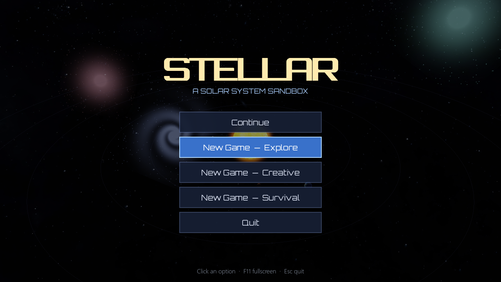
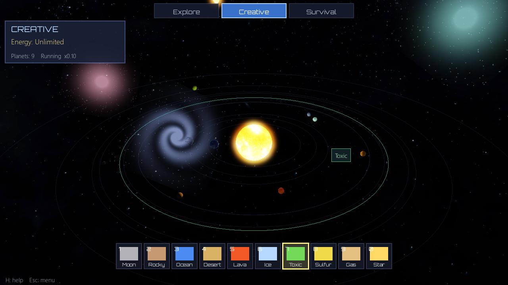
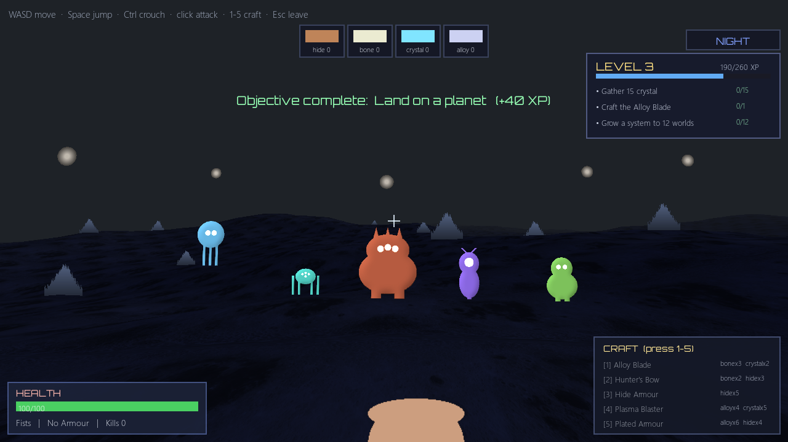
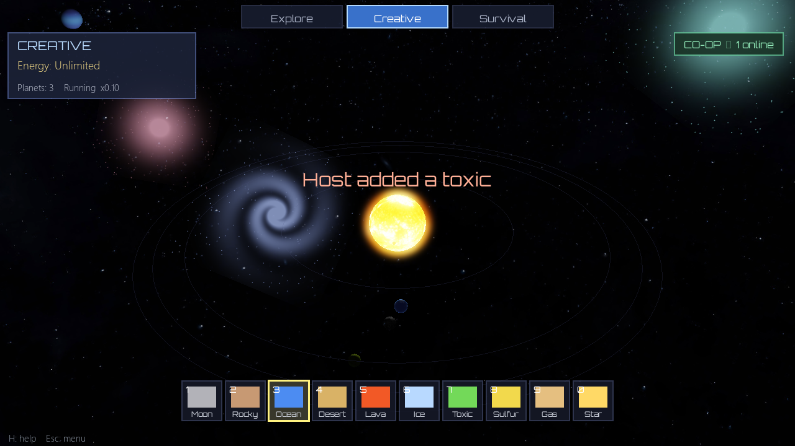

# Stellar — a solar system sandbox

A real-time 3D solar system game in Python using ModernGL (OpenGL 3.3) and
Pygame. Boots to a title screen; pick a mode with the mouse, build your own
universe, and pick up where you left off with **Continue**. Explore the real
solar system, freely build in Creative, or grow and defend one against incoming
comets in Survival. Real NASA-based textures, distant galaxies, a Milky Way
skybox, HDR bloom, day/night Earth, and Saturn's rings. Runs fullscreen, with
synthesized sound effects and soothing ambient music (press **M** to mute).



## Game modes

Switch any time with **F1 / F2 / F3**:

- **Explore** (F1) — the real solar system: 8 planets + Sun, true relative
  orbital periods and axial tilts. Sit back and fly around.
- **Creative** (F2) — unlimited energy. Click anywhere to place planets, moons,
  and gas giants on any orbit and build your own system.
- **Survival** (F3) — start with a star and a small energy budget. Planets in
  the *habitable zone* generate the most energy; spend it to expand. Rogue
  **comets** drift in and destroy planets on impact — **click a comet to deflect
  it**. The pressure ramps over time. Build fast, defend faster.

From the title screen, **Continue** resumes your saved game, or start a fresh one
in any mode. Your game autosaves when you return to the menu (Esc).

**Life & relics:** in Creative and Survival, your planets grow interactive
entities — **life** (green), **crystals** (cyan), and rare **relics** (gold) —
that orbit them. Click one to harvest it for energy and score; it regrows after
a while. In co-op, anyone can harvest, so there's plenty to do together.



## On the surface (first-person)

Press **L** (or right-click a planet) to open the **Land** menu, then click a
planet **by name** to teleport down into a first-person survival mode on its
surface. From the ground you can see the **Sun and the other planets in the
sky**, in their real directions.



- **L** land menu · **WASD** move · **Space** jump · **Ctrl** crouch ·
  **mouse** look · **left click** attack · **Esc** return to space.
- A big, roamable world with its own **rugged terrain** — large mountains,
  valleys and scattered rocks — lit by its Sun, with the rest of the solar
  system (colour-coded) up in the sky.
- A **day/night cycle**: the world is safe by day, but at **night** five alien
  species (critter, alien, brute, stalker, flyer) emerge — they **wander, then
  chase** you, each lit and shaded with its own look and movement (the flyer
  hovers!). Kill them for loot: **hide, bone, crystal, alloy**. They flee at dawn.
- Your equipped **weapon is shown in first person** and swings when you attack.
- **Craft** better gear with keys **1-5**: Alloy Blade, **Hunter's Bow** and
  Plasma Blaster (weapons), Hide and Plated Armour. Better weapons hit
  harder/farther; armour reduces the damage you take.
- Aliens are **lit and shaded** for a 3D look (not flat sprites).

Single-player for now (on-foot co-op is a future step). Terrain is heightmap-based
— true caves/overhangs are a future addition.

## Progress & objectives

Everything you do builds one **persistent profile** (saved to `profile.json`):
placing worlds, harvesting, deflecting comets, landing, gathering materials,
killing monsters and crafting all grant **XP**. You **level up**, which **unlocks**
new things to build (gas giants at Lv 2, stars at Lv 3 in Survival). A rolling
list of **objectives** ("Defeat 10 creatures", "Grow a system to 12 worlds",
"Craft the Plasma Blaster") gives you goals and bonus XP, shown with your level
and XP bar in the HUD and on the title screen. This ties the space and surface
halves into one game: gather on foot → build in space → level up → reach more.

## Run it

```bash
pip install -r requirements.txt
python main.py
```

Requires Python 3.10+ and a GPU supporting OpenGL 3.3 (any card from the last
decade). Developed and tested on an AMD Radeon RX 6600 XT.

## Controls

| Input              | Action                                  |
| ------------------ | --------------------------------------- |
| `F1` / `F2` / `F3` | Explore / Creative / Survival mode      |
| Click badges / bar | Switch mode or pick a body with the mouse |
| `1` – `0`          | Pick body: Moon, Rocky, Ocean, Desert, Lava, Ice, Toxic, Sulfur, Gas, Star |
| Left click         | Place selected body, or deflect a comet |
| `L` / right click  | Land on a planet (pick by name → first-person) |
| Drag mouse         | Orbit the camera                        |
| Scroll wheel       | Zoom in / out                           |
| `+` / `-`          | Speed up / slow down time               |
| `Space`            | Pause / resume                          |
| `H`                | Toggle the help overlay                 |
| `F11`              | Toggle fullscreen                       |
| `M`                | Mute / unmute audio                     |
| `R`                | Reset the camera                        |
| `Esc`              | Back to the title menu (autosaves)      |

## Project layout

```
main.py        window, input, modes, HUD, main loop
world.py       authoritative game state: bodies, comets, energy, commands
scene.py       renderer: planets, skybox, rings, comets, bloom pipeline
camera.py      orbital camera + mouse-ray picking
server.py      authoritative co-op server (websockets)
netclient.py   client networking (background thread + snapshots)
surface.py     first-person surface mode: creatures, loot, crafting
surface_scene.py  first-person renderer (terrain, sky, sprite creatures)
terrain.py     procedural heightmap terrain (mountains / valleys)
profile.py     persistent progression: XP, levels, objectives, unlocks
audio.py       synthesized sound effects + ambient music (no audio files)
hud.py         2D text/panel overlay (title, mode badges, hotbar, help)
sprites.py     procedural galaxy / nebula sprite generation
mesh.py        sphere / ring / quad geometry
shaders/       GLSL: planets, skybox, galaxies, clouds, rings, bloom passes
textures/      planet + galaxy texture maps
fonts/         Orbitron (UI font)
savegame.json  your saved game (created on Esc; git-ignored)
```

## Co-op multiplayer

Play together in real time. One machine runs an authoritative **server**
(`server.py`) that owns the world and the simulation clock; everyone else
connects and sees the exact same universe. Anyone can place worlds, deflect
comets, and switch modes — changes show up for all players instantly.



**Host a game**

- From the title screen click **Host Co-op Game**, optionally set a **room
  password**, and you're in — it starts a local server for you, or
- run the server yourself: `python server.py --mode creative --password secret`
  (mode also `explore` / `survival`; `--password` optional).

**Join a game**

- Click **Join Co-op Game**, enter the host's address (e.g.
  `ws://192.168.1.20:8765`) and the room password if there is one.

A room password keeps your world private even if the address is reachable —
recommended for any internet game.

**Where the host's address comes from**

- **Same Wi-Fi / LAN:** the host runs `ipconfig` (Windows) / `ip addr` and
  shares their local IP — `ws://<that-ip>:8765`.
- **Over the internet (anywhere in the world):** the host must make port `8765`
  reachable. Easiest options:
  - **[Tailscale](https://tailscale.com)** (recommended) — both install it; it
    puts your machines on one private network with no router setup. Join using
    the host's Tailscale IP.
  - A tunnel such as `ngrok tcp 8765` or [playit.gg](https://playit.gg), then
    join using the public address it gives you.
  - Or forward TCP port `8765` on the host's router to their PC.

**Security note:** the server has no authentication or encryption — anyone who
can reach the address can join and edit the world. Only share it with people you
trust, and prefer Tailscale, which keeps it private to your devices.

You can see each other live: a glowing coloured marker and the player's name
show where every teammate is pointing, so you can build together and say "put it
*here*". The co-op badge shows how many players are online.

Architecture: the `World` (`world.py`) is fully command-driven (`world.apply`)
and JSON-serialisable, so the server just applies commands and broadcasts state
snapshots (~20 Hz); clients extrapolate between snapshots for smooth motion.

## Credits

Planet, Sun, Moon, ring, and Milky Way textures by **Solar System Scope**
(<https://www.solarsystemscope.com/textures>), licensed under
[CC BY 4.0](https://creativecommons.org/licenses/by/4.0/). Based on NASA
elevation and imagery data.

UI font **Orbitron** by Matt McInerney, licensed under the
[SIL Open Font License 1.1](fonts/OFL.txt). Distant galaxies are generated
procedurally (`sprites.py`).
