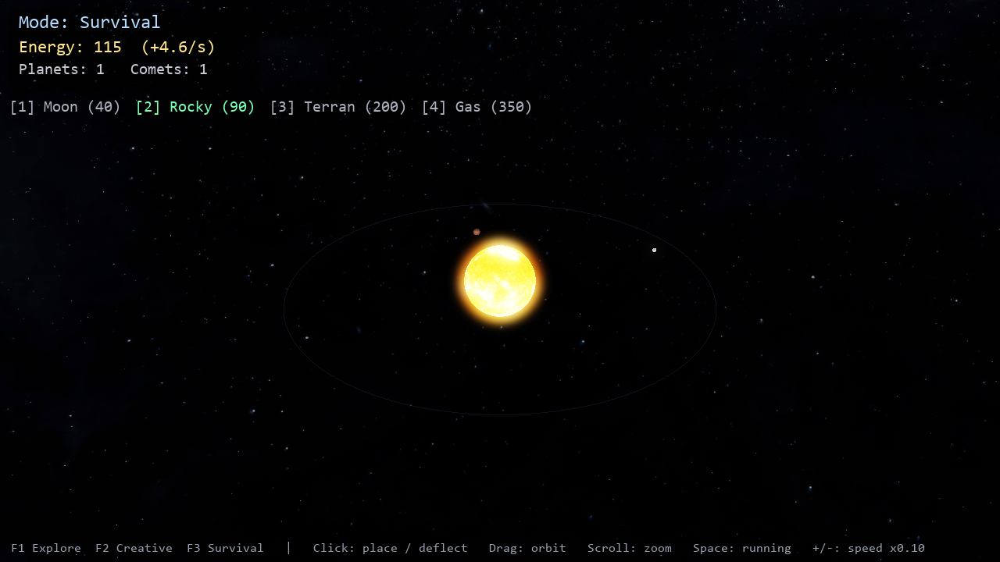

# Stellar — a solar system sandbox

A real-time 3D solar system game in Python using ModernGL (OpenGL 3.3) and
Pygame. Explore the real solar system, freely build your own in Creative, or
grow and defend one against incoming comets in Survival. Real NASA-based
textures, a Milky Way galaxy skybox, HDR bloom, day/night Earth, and Saturn's
rings.


## Game modes

Switch any time with **F1 / F2 / F3**:

- **Explore** (F1) — the real solar system: 8 planets + Sun, true relative
  orbital periods and axial tilts. Sit back and fly around.
- **Creative** (F2) — unlimited energy. Click anywhere to place planets, moons,
  and gas giants on any orbit and build your own system.
- **Survival** (F3) — start with a star and a small energy budget. Planets in
  the *habitable zone* generate the most energy; spend it to expand. Rogue
  **comets** drift in and destroy planets on impact — **click a comet to deflect
  it**. The pressure ramps over time. Build fast, defend faster.



## Run it

```bash
pip install -r requirements.txt
python main.py
```

Requires Python 3.10+ and a GPU supporting OpenGL 3.3 (any card from the last
decade). Developed and tested on an AMD Radeon RX 6600 XT.

## Controls

| Input              | Action                                  |
| ------------------ | --------------------------------------- |
| `F1` / `F2` / `F3` | Explore / Creative / Survival mode      |
| `1` `2` `3` `4`    | Select body: Moon / Rocky / Terran / Gas |
| Left click         | Place selected body, or deflect a comet |
| Drag mouse         | Orbit the camera                        |
| Scroll wheel       | Zoom in / out                           |
| `+` / `-`          | Speed up / slow down time               |
| `Space`            | Pause / resume                          |
| `R`                | Reset the camera                        |
| `Esc`              | Quit                                    |

## Project layout

```
main.py        window, input, modes, HUD, main loop
world.py       authoritative game state: bodies, comets, energy, commands
scene.py       renderer: planets, skybox, rings, comets, bloom pipeline
camera.py      orbital camera + mouse-ray picking
hud.py         2D text/panel overlay
mesh.py        sphere / ring / quad geometry
shaders/       GLSL: planets, skybox, clouds, rings, bloom passes
textures/      planet + galaxy texture maps
```

## Multiplayer roadmap

The whole universe lives in one command-driven `World` (`world.py`); every
change goes through `world.apply(command)`. That's the hook for co-op: a server
owns the authoritative `World` and broadcasts commands, and each client replays
them, so everyone sees the same universe.

1. **Shared world** — a small `asyncio`/`websockets` server holds the `World`
   and the sim clock; clients send `place` / `deflect` commands and receive
   state snapshots.
2. **Free-fly avatars** — each player has a labelled camera; the server relays
   positions so you can see each other.
3. **Co-op survival** — build and defend the same system together; one player
   expands while the other deflects comets.
4. **Authoritative physics later** — swap analytic orbits for real n-body
   gravity on the server so players can launch probes.

Suggested stack: `websockets` + JSON to start, `msgpack` if bandwidth matters.
Keep the server authoritative so nobody desyncs.

## Credits

Planet, Sun, Moon, ring, and Milky Way textures by **Solar System Scope**
(<https://www.solarsystemscope.com/textures>), licensed under
[CC BY 4.0](https://creativecommons.org/licenses/by/4.0/). Based on NASA
elevation and imagery data.
